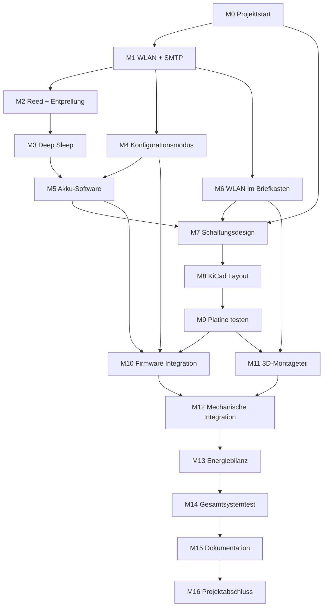

# Meilensteinplan: Briefkastenüberwachung

Projektplan zur Durchführung des TIV-Abschlussprojekts

> Bezugsdokument: [Anforderung.md](./Anforderung.md)

---

## Übersicht

| Phase | Meilenstein | Ziel |
|---|---|---|
| 0 | Projektstart | Anforderungen festgelegt, Plan erstellt |
| 1 | Software-Prototyp | Kernfunktionen auf Dev-Board nachgewiesen |
| 2 | Hardware-Prototyp | Stromversorgung und Sensorik auf Breadboard/Platine getestet |
| 3 | Integration | Firmware und Hardware zusammengeführt |
| 4 | Gehäuse & Montage | Mechanische Integration am Briefkasten |
| 5 | Systemtest & Energiebilanz | Gesamtsystem validiert, Laufzeit abgeschätzt |
| 6 | Abschluss | Projektdokumentation und Abgabe |

**Empfohlene Reihenfolge:** Risikoreiche Punkte (WLAN im Metallkasten, SMTP-Versand) werden in Phase 1 früh geprüft, nicht erst am Ende.

---

## Phase 0 — Projektstart

### Meilenstein M0: Anforderungen und Planung abgeschlossen

**Ziel:** Klare Projektbasis für die Umsetzung.

**Aufgaben:**

- [ ] Anforderungsdokument finalisieren
- [ ] Meilensteinplan abstimmen
- [ ] Hardware-Komponentenliste (Stückliste) erstellen
- [ ] Entwicklungsumgebung einrichten (PlatformIO / Arduino, KiCad)
- [ ] Dev-Board beschaffen (ESP32-WROOM-32)

**Ergebnis / Abnahmekriterium:**

- Anforderungen und Projektplan liegen vor
- Dev-Board und Grundkomponenten sind verfügbar

**Abhängigkeiten:** keine

---

## Phase 1 — Software-Prototyp (Dev-Board)

Ziel dieser Phase: Die kritischsten Software-Funktionen **ohne eigene Platine** nachweisen.

### Meilenstein M1: WLAN-Verbindung und SMTP-Versand

**Ziel:** ESP32 verbindet sich mit dem Heim-WLAN und versendet eine Test-E-Mail.

**Aufgaben:**

- [ ] ESP32-Projekt anlegen (PlatformIO empfohlen)
- [ ] WLAN-Verbindung mit fest codierten Zugangsdaten testen
- [ ] SMTP-Verbindung einrichten (Server, Port, TLS, App-Passwort)
- [ ] Test-E-Mail erfolgreich versenden

**Ergebnis / Abnahmekriterium:**

- Test-E-Mail kommt zuverlässig beim Empfänger an
- Verbindungsfehler werden erkannt und protokolliert (Serial Monitor)

**Abhängigkeiten:** M0

**Risiko:** SMTP-Konfiguration kann aufwendig sein → früh testen, ggf. alternativen Mail-Provider prüfen

---

### Meilenstein M2: Reedkontakt und Entprellung

**Ziel:** Öffnen des Briefkastens wird zuverlässig erkannt, Mehrfachauslösung wird verhindert.

**Aufgaben:**

- [ ] Reedkontakt an GPIO anschließen (Pull-up/Pull-down definieren)
- [ ] Öffnen der Klappe im Code erkennen
- [ ] 30-Sekunden-Sperre nach erkannter Öffnung implementieren
- [ ] Bei Öffnung Test-E-Mail auslösen

**Ergebnis / Abnahmekriterium:**

- Eine Öffnung → eine E-Mail
- Schnelles mehrfaches Öffnen innerhalb von 30 s → keine zusätzliche E-Mail

**Abhängigkeiten:** M1

---

### Meilenstein M3: Deep Sleep und Aufwecken

**Ziel:** Energiesparender Betriebszyklus funktioniert.

**Aufgaben:**

- [ ] GPIO als Wake-up-Source konfigurieren (Reedkontakt)
- [ ] Timer-Wake-up für tägliche Akkuprüfung einrichten
- [ ] Ablauf implementieren: Aufwachen → Aktion → Deep Sleep
- [ ] Stromaufnahme im Deep Sleep grob messen (Multimeter oder USB-Strommessgerät)

**Ergebnis / Abnahmekriterium:**

- Aufwecken durch Reedkontakt funktioniert
- Aufwecken durch Timer funktioniert
- ESP32 kehrt nach Aktion zuverlässig in Deep Sleep zurück

**Abhängigkeiten:** M2

---

### Meilenstein M4: Konfigurationsmodus

**Ziel:** Einstellungen können ohne Code-Änderung über Webinterface hinterlegt werden.

**Aufgaben:**

- [ ] Taster-Abfrage beim Boot implementieren
- [ ] Access Point mit festem Namen/Passwort aufbauen
- [ ] Webserver mit Konfigurationsformular bereitstellen
- [ ] Einstellungen dauerhaft speichern (NVS / Preferences):
  - WLAN-SSID und Passwort
  - Empfängeradresse
  - SMTP-Server, Port, Benutzername, Passwort
- [ ] Gespeicherte Werte beim Normalstart laden und nutzen

**Ergebnis / Abnahmekriterium:**

- Taster beim Boot → Konfigurationsmodus aktiv
- Ohne Taster → Normalbetrieb
- Nach Neustart bleiben Einstellungen erhalten
- Mit gespeicherten Werten funktioniert WLAN-Verbindung und E-Mail-Versand

**Abhängigkeiten:** M1

---

### Meilenstein M5: Akkuspannungsmessung (Software)

**Ziel:** Unterspannung wird erkannt und per E-Mail gemeldet.

**Aufgaben:**

- [ ] ADC-Auslesung mit Spannungsteiler testen (zunächst mit variablem Netzteil oder Poti)
- [ ] ADC-Wert in Akkuspannung umrechnen
- [ ] Schwellwert definieren und konfigurierbar machen (optional fest im Code)
- [ ] Warn-E-Mail bei Unterschreitung versenden
- [ ] Tägliche Timer-Prüfung mit Akku-Logik verbinden
- [ ] Verhindern, dass bei jedem täglichen Wake-up erneut eine Warn-Mail gesendet wird (Einmal-Meldung bis Akku wieder ok)

**Ergebnis / Abnahmekriterium:**

- Simulierte/unterschrittene Spannung löst genau eine Warn-E-Mail aus
- Tägliche Prüfung läuft unabhängig vom Reedkontakt

**Abhängigkeiten:** M3, M4

---

### Meilenstein M6: WLAN-Test im Briefkasten (Risikoprüfung)

**Ziel:** Empfang im Metallbriefkasten ist ausreichend — oder Gegenmaßnahme ist bekannt.

**Aufgaben:**

- [ ] Dev-Board im/ am echten Briefkasten platzieren
- [ ] RSSI / Verbindungsqualität messen
- [ ] Verschiedene Positionen testen (innen, seitlich, nah an Öffnung)
- [ ] Ergebnis dokumentieren und Montagestrategie festlegen

**Ergebnis / Abnahmekriterium:**

- WLAN-Verbindung im Zielbetrieb ist stabil genug für E-Mail-Versand
- Falls nicht: dokumentierte Alternative (andere Position, Antennenführung im 3D-Teil)

**Abhängigkeiten:** M1

> **Wichtig:** Diesen Meilenstein nicht auf später verschieben. Bei schlechtem Empfang muss die Hardware-Montage angepasst werden.

---

## Phase 2 — Hardware-Prototyp

### Meilenstein M7: Schaltungsdesign und Stückliste

**Ziel:** Vollständiges Schaltungskonzept für die eigene Platine.

**Aufgaben:**

- [ ] Blockschaltbild erstellen
- [ ] Komponenten festlegen:
  - ESP32-WROOM-32 Modul
  - LDO (3,3 V)
  - LiPo-Ladeschaltung (USB-C)
  - Akkuschutz (Kurzschluss, Unterspannung)
  - Spannungsteiler für ADC
  - Schraubklemme für Reedkontakt
  - Taster für Konfigurationsmodus
  - LDR mit Lötbrücke (optional)
  - Test-LEDs mit Lötbrücken
- [ ] Stückliste (BOM) mit Artikelnummern/Bezugsquellen erstellen

**Ergebnis / Abnahmekriterium:**

- Schaltplan liegt vor
- Alle Bauteile sind bestellt oder verfügbar

**Abhängigkeiten:** M0, Erkenntnisse aus M5 und M6

---

### Meilenstein M8: Platinenlayout (KiCad)

**Ziel:** Produktionsfähiges Platinenlayout.

**Aufgaben:**

- [ ] KiCad-Projekt anlegen
- [ ] Schaltplan in KiCad übertragen
- [ ] PCB-Layout erstellen (Platine, Anschlüsse, USB-C, Montagelöcher)
- [ ] Design Rule Check (DRC) durchführen
- [ ] Platine bestellen oder ätzen

**Ergebnis / Abnahmekriterium:**

- KiCad-Projekt ohne DRC-Fehler
- Platine ist bestellt oder gefertigt

**Abhängigkeiten:** M7

---

### Meilenstein M9: Hardware-Prototyp bestücken und testen

**Ziel:** Platine funktioniert elektrisch, bevor die Firmware final integriert wird.

**Aufgaben:**

- [ ] Platine bestücken und löten
- [ ] Spannungsversorgung prüfen (LDO-Ausgang 3,3 V)
- [ ] USB-C-Laden testen
- [ ] Akkuschutz testen (Unterspannung, Kurzschluss — vorsichtig und kontrolliert)
- [ ] Spannungsteiler / ADC mit Multimeter verifizieren
- [ ] Reedkontakt über Schraubklemme anschließen und testen

**Ergebnis / Abnahmekriterium:**

- ESP32 startet auf eigener Platine
- Alle Spannungsebenen sind korrekt
- Laden und Entladen funktionieren sicher

**Abhängigkeiten:** M8

---

## Phase 3 — Integration

### Meilenstein M10: Firmware auf Zielhardware

**Ziel:** Alle Software-Meilensteine laufen auf der eigenen Platine.

**Aufgaben:**

- [ ] Firmware von Dev-Board auf Zielplatine portieren
- [ ] GPIO-Pins an tatsächliches Layout anpassen
- [ ] Konfigurationsmodus auf Zielhardware testen
- [ ] Reedkontakt → E-Mail auf Zielhardware testen
- [ ] Deep Sleep und Timer-Wake-up auf Zielhardware testen
- [ ] Akkuüberwachung mit echtem LiPo testen

**Ergebnis / Abnahmekriterium:**

- Alle Funktionen aus Phase 1 laufen auf der eigenen Platine
- Keine Regression gegenüber dem Dev-Board-Prototyp

**Abhängigkeiten:** M4, M5, M9

---

## Phase 4 — Gehäuse und Montage

### Meilenstein M11: 3D-Montageteil

**Ziel:** Platine ist sicher und reproduzierbar am Briefkasten montierbar.

**Aufgaben:**

- [ ] 3D-Modell für Magnet-Halterung entwerfen
- [ ] Abstand Platine ↔ Gehäusemagnete ↔ Reedkontakt berücksichtigen
- [ ] Bauteil drucken und Passung prüfen
- [ ] ggf. Iteration des Designs

**Ergebnis / Abnahmekriterium:**

- Platine hält zuverlässig am Briefkasten
- Reedkontakt wird nicht durch Gehäusemagnete beeinflusst

**Abhängigkeiten:** M6, M9

---

### Meilenstein M12: Mechanische Integration

**Ziel:** Gesamtsystem am echten Briefkasten installiert.

**Aufgaben:**

- [ ] Reedkontakt an Briefkastenklappe montieren (kleiner Magnet am Rahmen)
- [ ] Kabelverlegung zum Schraubklemmen-Terminal
- [ ] Platine mit 3D-Teil und Magneten befestigen
- [ ] WLAN-Empfang im finalen Aufbau erneut prüfen
- [ ] Öffnen der Klappe im realen Betrieb testen

**Ergebnis / Abnahmekriterium:**

- System sitzt mechanisch stabil
- Öffnung wird zuverlässig erkannt
- E-Mail kommt nach realer Öffnung an

**Abhängigkeiten:** M10, M11

---

## Phase 5 — Systemtest und Energiebilanz

### Meilenstein M13: Strommessung und Laufzeitabschätzung

**Ziel:** Nachweis der Energieeffizienz und realistische Akkulaufzeit.

**Aufgaben:**

- [ ] Stromaufnahme messen in:
  - Deep Sleep
  - Wake-up + WLAN-Verbindung
  - SMTP-Versand
  - Konfigurationsmodus
- [ ] typischen Tageszyklus modellieren (z. B. 0–5 Öffnungen/Tag + 1× Akkuprüfung)
- [ ] Laufzeitabschätzung berechnen
- [ ] Ergebnisse dokumentieren

**Ergebnis / Abnahmekriterium:**

- Messwerte und Berechnung liegen vor
- Einschätzung der Akkulaufzeit ist nachvollziehbar begründet

**Abhängigkeiten:** M12

---

### Meilenstein M14: Gesamtsystemtest

**Ziel:** Alle Anforderungen aus dem Anforderungsdokument sind nachgewiesen.

**Aufgaben:**

- [ ] Testprotokoll erstellen
- [ ] Alle Ereignisse aus der Funktionsübersicht testen:

| Testfall | Erwartetes Ergebnis |
|---|---|
| Briefkasten öffnen | E-Mail wird versendet |
| Mehrfaches Öffnen < 30 s | Keine weitere E-Mail |
| Akku unter Schwellwert | Warn-E-Mail (einmalig) |
| Täglicher Timer-Wake-up | Akkuprüfung ohne Reed-Ereignis |
| Taster beim Boot | Konfigurationsmodus |
| Normaler Boot | Deep Sleep, kein Konfigurationsmodus |
| Einstellungen ändern | Neue Werte werden gespeichert und genutzt |

- [ ] Abweichungen dokumentieren und ggf. beheben

**Ergebnis / Abnahmekriterium:**

- Testprotokoll mit Datum, Ergebnis und ggf. Screenshots/Fotos
- Alle Kernanforderungen bestanden oder bewusst dokumentiert eingeschränkt

**Abhängigkeiten:** M13

---

## Phase 6 — Abschluss

### Meilenstein M15: Projektdokumentation

**Ziel:** Vollständige Dokumentation für Abgabe und Präsentation.

**Aufgaben:**

- [ ] Projektbericht schreiben (Einleitung, Anforderungen, Umsetzung, Tests, Fazit)
- [ ] Schaltplan, Platinenlayout, Stückliste beifügen
- [ ] Fotos vom Aufbau und der Montage
- [ ] Testprotokolle und Energiebilanz einbinden
- [ ] Sicherheitshinweise zum Konfigurations-Webserver ergänzen
- [ ] Ausblick auf mögliche Erweiterungen (Schaltregler, Push-Benachrichtigung, …)

**Ergebnis / Abnahmekriterium:**

- Dokumentation ist vollständig und abgabefähig

**Abhängigkeiten:** M14

---

### Meilenstein M16: Projektabschluss

**Ziel:** Projekt ist abgeschlossen und präsentationsbereit.

**Aufgaben:**

- [ ] Finale Version der Firmware archivieren
- [ ] KiCad-Projekt und 3D-Dateien archivieren
- [ ] Präsentation vorbereiten (Demo: Öffnen → E-Mail)
- [ ] Projekt abgeben / vorstellen

**Ergebnis / Abnahmekriterium:**

- Funktionierendes Gesamtsystem
- Dokumentation abgegeben
- Präsentation durchgeführt

**Abhängigkeiten:** M15

---

## Abhängigkeitsdiagramm (vereinfacht)

---

## Priorisierung bei Zeitdruck

Falls weniger Zeit zur Verfügung steht, sind folgende Meilensteine **kritisch** und sollten nicht gestrichen werden:

1. **M1** — WLAN + SMTP (ohne das kein Projektkern)
2. **M2** — Reedkontakt + Entprellung
3. **M6** — WLAN im Briefkasten (früh!)
4. **M4** — Konfigurationsmodus
5. **M10** — Integration auf eigener Platine
6. **M14** — Gesamtsystemtest

Folgende Punkte können bei Bedarf vereinfacht werden:

- **M5 / Akku-Warnung:** Schwellwert fest im Code statt konfigurierbar
- **LDR auf Platine:** Nur bestücken, wenn Zeit für Vergleichsmessung bleibt
- **3D-Teil:** Provisorische Montage mit Klemmen/Magneten, Design später verfeinern

---

## Empfohlene Meilenstein-Reihenfolge (Kurzfassung)

| Nr. | Meilenstein | Phase |
|---|---|---|
| M0 | Projektstart | 0 |
| M1 | WLAN + SMTP | 1 |
| M6 | WLAN im Briefkasten ⚠️ | 1 |
| M2 | Reed + Entprellung | 1 |
| M3 | Deep Sleep | 1 |
| M4 | Konfigurationsmodus | 1 |
| M5 | Akku-Software | 1 |
| M7 | Schaltungsdesign | 2 |
| M8 | KiCad Layout | 2 |
| M9 | Platine testen | 2 |
| M10 | Firmware-Integration | 3 |
| M11 | 3D-Montageteil | 4 |
| M12 | Mechanische Integration | 4 |
| M13 | Energiebilanz | 5 |
| M14 | Gesamtsystemtest | 5 |
| M15 | Dokumentation | 6 |
| M16 | Projektabschluss | 6 |

---

## Offene Punkte während der Durchführung

Diese Punkte werden im Projektverlauf beantwortet, nicht vorab:

- [ ] Reicht WLAN-Empfang im Metallbriefkasten?
- [ ] Welcher SMTP-Provider wird verwendet?
- [ ] Welche Akkulaufzeit ist realistisch erreichbar?
- [ ] Welche GPIO-Pins werden im finalen Layout verwendet?
- [ ] Muss das 3D-Teil eine Antennenführung vorsehen?
